  

 

  
  &nbsp;
  

 

  <picture>
    <source media="(prefers-color-scheme: dark)" srcset="https://raw.githubusercontent.com/gorlock777/gorlock777/output/github-contribution-grid-snake-dark.svg">
    <source media="(prefers-color-scheme: light)" srcset="https://raw.githubusercontent.com/gorlock777/gorlock777/output/github-contribution-grid-snake.svg">
    
  </picture>

  

    
<b>View 3D Contribution Graph</b>

     
    <picture>
      <source media="(prefers-color-scheme: dark)" srcset="https://raw.githubusercontent.com/gorlock777/gorlock777/main/profile-3d-contrib/profile-night-view.svg">
      <source media="(prefers-color-scheme: light)" srcset="https://raw.githubusercontent.com/gorlock777/gorlock777/main/profile-3d-contrib/profile-green-animate.svg">
      
    </picture>
  

  

 

<table width="100%">
  <tr>
    <td width="60%" valign="middle">
      

        Full-stack developer building performant web applications, clean backend architectures, and tooling.
      

      <ul>
        <li>Developing full-stack systems and open source software</li>
        <li>Exploring distributed architectures, systems programming, and Rust</li>
        <li>Focused on writing maintainable code and building high-throughput services</li>
      </ul>
    </td>
    <td width="40%" align="center" valign="middle">
      
    </td>
  </tr>
</table>

  

 

  

  

 

  

